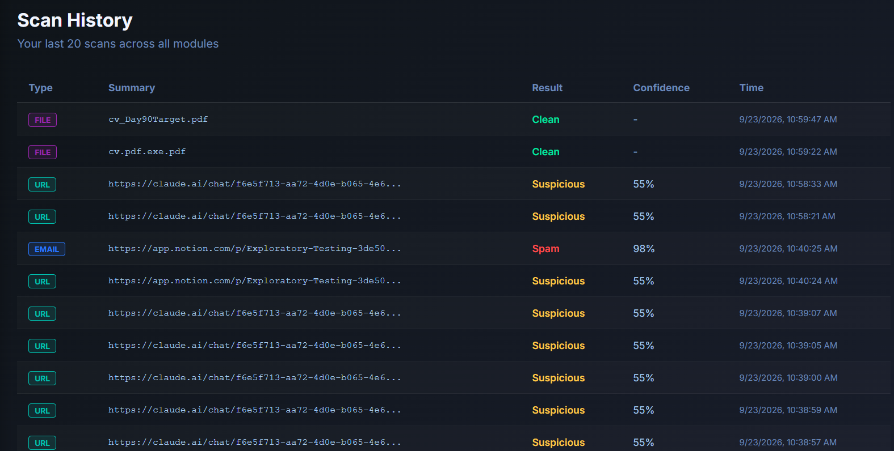

# bugs

# Bugs found in CyberSentinel AI

---

## BUG_01

**Title:** Non-URL text auto-converted and scanned as a URL instead of being rejected
**Environment:** CyberSentinel AI, Scan URL module
**Severity:** Medium | **Priority:** Medium
**Precondition:** User is on the Scan URL page
**Reproduction Steps:**

1. Paste a paragraph of plain, non-URL text into the input field
2. Click "Scan Link"

**Expected Result:** System should reject non-URL input with a clear error message
**Actual Result:** System auto-prefixes the text with `https://` and scans it as if it were a valid URL
**Root Cause Hypothesis:** Input handling likely auto-formats any text lacking a protocol prefix rather than first validating it's a genuine URL
**Evidence:** TC_04
**Status:** Open — logged, not yet fixed

---

## BUG_02

**Title:** Oversized email upload shows a generic error instead of a specific size-limit message
**Environment:** CyberSentinel AI, Analyze Email module
**Severity:** Low | **Priority:** Low
**Precondition:** User is on the Analyze Email page
**Reproduction Steps:**

1. Upload an email/file larger than the 32MB limit
2. Click "Scan Email"

**Expected Result:** A specific error such as "Email size exceeds the 32MB limit"
**Actual Result:** Generic "Scan Failed, please try again" — no indication of the actual cause
**Root Cause Hypothesis:** The Email module's size-limit check likely doesn't pass a specific error message back to the UI, unlike the File module, which handles this correctly
**Evidence:** TC_08
**Status:** Open — logged, not yet fixed

---

## BUG_03

**Title:** Legitimate domains can be scored "Suspicious" due to overlapping structural rules
**Environment:** CyberSentinel AI, Scan URL module
**Severity:** Medium | **Priority:** Medium
**Precondition:** User is on the Scan URL page
**Reproduction Steps:**

1. Paste a known-legitimate URL (e.g. `accounts.google.com`)
2. Click "Scan Link"

**Expected Result:** A trusted, legitimate domain should return a "Safe" verdict
**Actual Result:** Scored 3/10, "Suspicious" — legitimate URLs can trigger multiple structural rules (length, subdomain count, etc.) simultaneously with no allowance for domain reputation
**Root Cause Hypothesis:** The scoring engine has no whitelist/reputation override for well-known legitimate domains, so structurally "unusual" but harmless URLs get flagged like genuinely suspicious ones
**Evidence:** TC_24
**Status:** Open — logged, not yet fixed

---

## BUG_04

**Title:** File scan requires manual retry when VirusTotal doesn't respond within the polling window
**Environment:** CyberSentinel AI, Scan File module
**Severity:** Low-Medium | **Priority:** Low
**Precondition:** User is on the Scan File page, uploading a genuinely new (never-before-scanned) file
**Reproduction Steps:**

1. Upload a new file and click "Scan File"
2. Wait through the full polling window (15s x 4 = 60 seconds) without a result

**Expected Result:** System should either continue resolving automatically once ready, or clearly explain that a manual retry is needed
**Actual Result:** Shows a "please wait and try again" message; only produces a result once the user manually retries
**Root Cause Hypothesis:** Polling likely has a hard cutoff at 4 attempts with no background continuation or automatic follow-up once VirusTotal responds
**Evidence:** TC_31
**Status:** Open — logged, not yet fixed

---

## BUG_05

**Title:** Legitimate transactional and notification emails are consistently misclassified as Phishing
**Environment:** CyberSentinel AI, Phishing Email Detection module, live deployment
**Severity:** High | **Priority:** High
**Precondition:** User has access to the Analyze Email feature
**Reproduction Steps:**

1. Paste the text of a legitimate transactional/notification email
2. Click "Scan Email"

**Expected Result:** Legitimate, non-malicious emails should return a "Safe" verdict
**Actual Result:** 5 out of 5 tested legitimate emails across unrelated categories were flagged Phishing:

| Email type | Verdict | Confidence |
| --- | --- | --- |
| Platform notification (uTest) | Phishing | 91% |
| Industry newsletter | Phishing | 51% |
| Job posting notification | Phishing | 80% |
| Bank transaction confirmation | Phishing | 94% |
| Bank login security alert | Phishing | 97% |

**Root Cause Hypothesis:** The model over-weights surface vocabulary (login, verify, account, transaction) shared by legitimate security/financial emails and genuine phishing; training data likely underrepresented this legitimate category
**Evidence:** Saved outputs of all 5 emails with verdicts/confidence scores
**Status:** Open — high risk of users learning to ignore the tool's warnings ("cry wolf" effect)

---

## BUG_06

**Title:** Generic, non-actionable error shown for both server outages and client-side network drops
**Environment:** CyberSentinel AI, multiple modules
**Severity:** Medium | **Priority:** Medium
**Precondition:** Either the backend is down, or the user's network connection drops mid-request
**Reproduction Steps:**

1. Trigger a backend outage (live deployment) OR disconnect internet mid-scan
2. Observe the resulting error message

**Expected Result:** Distinct, actionable messages for each cause (e.g. "Check your internet connection" vs. "Server temporarily unavailable")
**Actual Result:** Both cases show the identical message: "Unable to reach server. Make sure the backend is running." — technical/developer-facing wording, not useful for the app's stated non-technical target audience
**Root Cause Hypothesis:** Error handling likely uses one catch-all message for any failed network request, without distinguishing failure source
**Evidence:** Observed in Charter 1 (live deployment) and Charter 3 (network disconnection)
**Status:** Open — logged, not yet fixed

---

## BUG_07

**Title:** Scan history displays all users' scans, not filtered to the logged-in user
**Environment:** CyberSentinel AI, Scan History feature, live deployment
**Severity:** Critical | **Priority:** Critical
**Precondition:** User is logged in; other users have performed scans
**Reproduction Steps:**

1. Log in as any user
2. Navigate to Scan History

**Expected Result:** Only the logged-in user's own scans should be visible
**Actual Result:** Scan history displays scans belonging to all users, not filtered by account
**Root Cause Hypothesis:** The scan history query likely lacks a filter restricting results to the authenticated user's own ID — a missing authorization check (Broken Access Control)
**Evidence:** Screenshot of scan history showing entries not created by the logged-in test account

**Status:** Open — recommended for prompt attention given this is live and may expose sensitive data (scanned URLs, filenames, email content) across accounts

---

## BUG_08

**Title:** Chrome extension does not analyze emails; reports every sender as "trusted"
**Environment:** CyberSentinel AI Chrome Extension, Gmail integration
**Severity:** Critical | **Priority:** High
**Precondition:** Extension installed and active on Gmail
**Reproduction Steps:**

1. Open any email from any sender in Gmail
2. Activate the CyberSentinel extension check

**Expected Result:** Extension should analyze the actual sender and flag suspicious/untrusted senders appropriately
**Actual Result:** Extension shows "trusted sender: [google.com](http://google.com/)" for every email tested, regardless of actual sender address
**Root Cause Hypothesis:** Sender-detection logic is likely hardcoded or defaulting to a placeholder value rather than reading the actual email header
**Evidence:** Multiple emails from different real senders, all returning identical "trusted: [google.com](http://google.com/)" result
**Status:** Open — a security feature that always reports "trust this" is worse than no feature at all, since it actively misleads users

---

## BUG_09

**Title:** File-type restriction validates by extension only, not actual content
**Environment:** CyberSentinel AI, Malware File Scanner
**Severity:** Medium-High | **Priority:** Medium
**Precondition:** User is on the Scan File page
**Reproduction Steps:**

1. Take a plain text file and rename it to have a `.pdf` extension
2. Upload and scan it

**Expected Result:** System should validate actual file content/type, not just trust the filename extension
**Actual Result:** File uploaded and scanned successfully despite its real content not matching its claimed extension
**Root Cause Hypothesis:** File-type check likely reads only the filename string, with no content/magic-byte verification
**Evidence:** Renamed file accepted and processed without any type-mismatch warning
**Status:** Open — combined with the double-extension finding (Enhancement list), this shows the entire file-type allowlist can be bypassed by renaming alone

---

## BUG_10

**Title:** Signup displays "can't connect to server" error despite successfully creating the account
**Environment:** CyberSentinel AI, Signup flow, live deployment
**Severity:** Medium | **Priority:** Medium
**Precondition:** User is on the Signup page with a new, unused email
**Reproduction Steps:**

1. Enter a new email and password, click Sign Up
2. Note the error shown
3. Attempt Sign Up again with the same details

**Expected Result:** A successful signup should show a success message, not an error; if it truly fails, no account should be created
**Actual Result:** First attempt shows "can't connect to server" (implying failure); second attempt reveals the account was actually created ("email already registered")
**Root Cause Hypothesis:** Account creation likely succeeds server-side, but the confirmation response back to the frontend fails or times out, causing a false error to display
**Evidence:** Screenshot of first-attempt error, 

followed by second attempt "already registered" message

Status: Open - misleads users into thinking signup failed when it actually succeeded